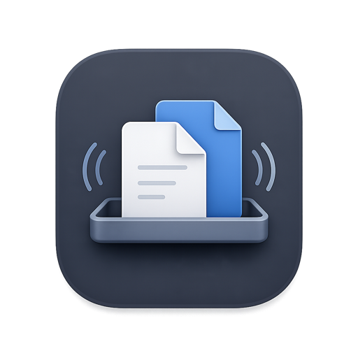
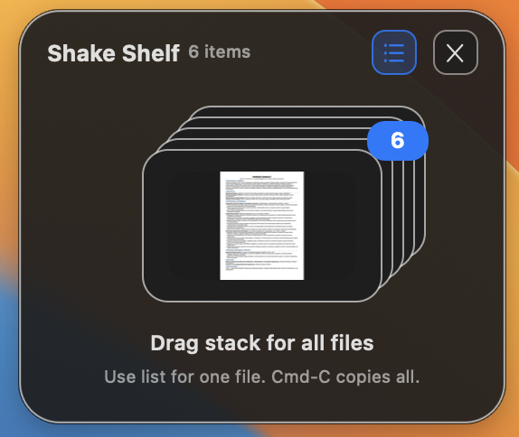
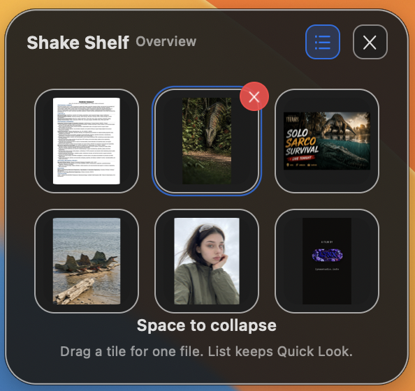
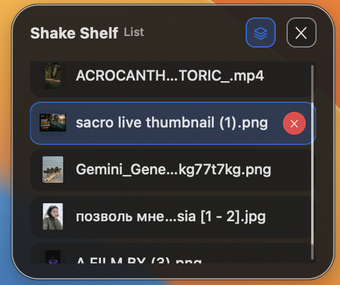
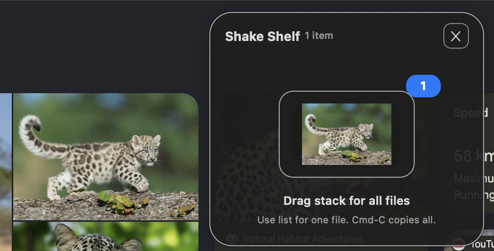

# Shake Shelf

<p align="center">
  
</p>

<p align="center"><strong>Shake while you drag. Park your files on a shelf. Fold it all into a floating ball.</strong></p>

Shake Shelf is a free, open-source shelf utility for macOS that lives in the menu bar. It solves the oldest drag-and-drop annoyance on the Mac: the destination is buried behind windows, on another Space, or in another app. Instead of holding a file over the edge of the screen while you fish for a folder, you shake — and a shelf appears right where your hand already is.

No account. No subscription. No analytics. Everything stays on your Mac.

## Why it exists

macOS drag-and-drop is great until the drop target isn't visible. Shake Shelf is the missing in-between: a small tray that appears on demand, holds whatever you're moving, and gets out of the way when you're done. It is deliberately lean — it is a shelf, not a productivity suite.

## The gesture that makes it different

1. **Pick up** a file (or several) in Finder, an app, or a browser.
2. **Shake** left-right while holding it.
3. **Drop** onto the shelf that appears under your cursor.

Release and the shelf stays. Open the destination, then drag the whole stack out at once — or grab one file at a time. When you're done, the shelf folds back into its ball.

## The ball

When you're not using it, the shelf **compresses into a small translucent metal ball** — about one-sixth the size of the shelf — that floats above everything, stays see-through over your work, and never blocks a click you didn't aim at it.

- **Hover it to open.** Pause your pointer over the ball and it blooms open in place, right above it.
- **Click it to open.** Instant, no waiting for the hover timer.
- **Drag it to move it.** Press, hold, drag — the ball is a physical handle. Its home position is remembered across launches. (Moving your cursor never opens it; only resting it does, so grabbing always wins.)
- **Shake it to open it.** The ball obeys the same shake gesture as everything else.
- **It returns home.** A shelf summoned by a shake at the top of the screen folds back down to the ball's home corner when you're done — no stray balls left over your work.
- **Right-click it** for *Open Shelf*, *Reset Ball to Corner*, and *Quit Shake Shelf* — plus a live count of what's inside.
- **The X is the minimize.** Folding the shelf into the ball is the whole point: there is nothing to close and nothing to restart. Quit lives in the menu bar icon and the ball's right-click menu if you ever want out.

The ball's animations are built for feel *and* restraint: a rest-detected hover glow, a press-down squash, an overshoot bloom when it opens, and a settle pop when it lands. Everything is Core Animation on layers — GPU-composited, zero per-frame drawing, and completely still when idle.

## Shelf modes

<table>
  <tr>
    <td width="50%" valign="top">
      
      <br>
      <strong>Stack mode</strong>
      <br>
      <sub>Drop files onto the shelf, then drag the stack out when you want all of them.</sub>
    </td>
    <td width="50%" valign="top">
      
      <br>
      <strong>Space overview</strong>
      <br>
      <sub>Press Space to spread files out. Drag one tile, remove one tile, or collapse back to the stack.</sub>
    </td>
  </tr>
  <tr>
    <td width="50%" valign="top">
      
      <br>
      <strong>List mode</strong>
      <br>
      <sub>Use the list when filenames matter: scroll, drag one file, copy one file, Quick Look, or remove it.</sub>
    </td>
    <td width="50%" valign="top">
      
      <br>
      <strong>Web and app drops</strong>
      <br>
      <sub>Drop images from browsers and apps when macOS provides a real file, image data, or file promise.</sub>
    </td>
  </tr>
</table>

## What works

- Summon the shelf by shaking while dragging a file — the shelf appears at your cursor, on any Space, over any app.
- Drop files, folders, images, videos, PDFs, and apps. Drop images from apps and the web when macOS provides image data or a promised file.
- See real thumbnails: images are decoded off the main thread; videos, PDFs, and other formats get Quick Look thumbnails. Icons appear instantly, thumbnails fade in when ready — a huge photo never stalls the UI.
- Drag the whole stack out together, or expand the overview and drag one tile at a time.
- List mode for large shelves: scroll, drag one file, select rows.
- Copy with Command-C — the whole stack, or one selected file. Paste anywhere.
- Quick Look on the shelf (Space or double-click). Quick Look opened from the shelf cleans up after itself.
- Remove one file (small X, Delete key, or right-click) or clear the shelf entirely.
- Move the shelf by dragging its top header.
- **Shelf history**: every stable state of the shelf is remembered as a session — what was on it, when, for how long — kept locally for 7 days. Restore any session with Replace or Append (or press ⌃⌥R for the last one). Clearing the shelf automatically saves what was there first, so accidental clears are recoverable.
- **Settings**: shake sensitivity, launch at login, keep items across relaunches, and the ball toggle (turn it off for an always-open shelf).

For normal local files, Shake Shelf stores references, not copies. Raw image drops and promised files from other apps are saved into `~/Library/Application Support/Shake Shelf/Incoming/` so the shelf always has a real file to hand back.

## Focus behavior

Shake Shelf is careful about focus, because it has to be:

- After a shake, focus returns to the app you were dragging from — your Space key keeps working in Finder immediately.
- Quick Look on the shelf only responds to Space when your pointer is over the shelf, and the shelf's Quick Look panel closes the moment you switch away — it never blocks Finder's own previews.
- Hover-opening the ball never steals keyboard focus; you can bloom the shelf while typing in another app and nothing is interrupted.

## Reliability, because a shelf is useless if it crashes

- **It can never make itself invisible.** The shelf's close path can only return focus to your previous app — the app cannot hide itself (the fix for a real-world "it crashed!" bug: a menu-bar app with no Dock icon that hides itself looks exactly like a crash).
- **A main-thread watchdog** logs it if the UI stalls for more than three seconds.
- **Every show, fold, expand, and drag is logged** with its reason to `~/Library/Application Support/Shake Shelf/Diagnostics.log` (rotated at 2 MB), so any misbehavior can be traced to the exact code path.
- **An automated in-app smoke test** drives add/remove/overview/list/copy/Quick Look/persistence end-to-end.
- **63 unit tests** cover the pure logic — drag resolution, copy/Quick Look selection, list scrolling, history storage, and every ball-behavior decision (hover dwell, idle collapse vetoes, geometry clamping).

## Requirements

- macOS 14 or newer
- Apple Silicon or Intel

## Install

Download the DMG from the [GitHub Releases](https://github.com/paresh795/shake-shelf/releases) page, open it, and drag **Shake Shelf.app** to Applications.

The app is free and ad-hoc signed. On first launch, macOS may block a normal double-click:

1. Open Finder and go to Applications.
2. Control-click **Shake Shelf.app**.
3. Click **Open** and confirm once.

If macOS asks for any permission, allow it — the shake detector reads drag events while you are dragging files in other apps.

On first launch a small "running" window appears with a test shelf button. Close it when you're done; you can reopen it from the menu bar icon.

## Build locally

```sh
swift test                        # 63 unit tests
./script/run_shakeshelf.sh --verify
./script/package_dmg.sh           # app + DMG written to dist/
```

To run the automated in-app smoke test (drives the full shelf flow and logs results to the diagnostics log):

```sh
launchctl setenv SHAKE_SHELF_SMOKE_TEST 1
./script/run_shakeshelf.sh run
launchctl unsetenv SHAKE_SHELF_SMOKE_TEST
```

## Project layout

```
Sources/
  ShakeShelf/        the app: views, window/panel controllers, monitoring
  ShakeShelfCore/    pure logic: gesture recognition, drop/copy resolution,
                     list scrolling, history storage, ball behavior
Tests/               unit tests for the core logic
docs/                screenshots and feature notes
```

The split is deliberate: everything testable lives in `ShakeShelfCore` as pure functions with no AppKit dependency, so the behavior is pinned down by tests while the app layer stays thin.

## Compared to other shelf apps

Dropover, Yoink, and friends are excellent tools, and if you already pay for one and love it, keep it. Shake Shelf's angle is different:

- **Free forever, open source, MIT-licensed.** Use it, fork it, ship it in your own tooling. No trial counter, no license file, no subscription.
- **Gesture-first.** The shake is the interface: the shelf comes to you, mid-drag, wherever your hand is. There is nothing to click before you need it.
- **The ball.** No dock icon to manage, no floating window to lose — the shelf literally folds away into a small translucent orb that waits where you left it.
- **Native and lean.** A menu-bar utility written in Swift and AppKit, no Electron, no network calls at all, a few tens of megabytes on disk.

## License

[MIT](LICENSE) — free to use and modify. Contributions are welcome: bug reports, feature ideas, or pull requests.
